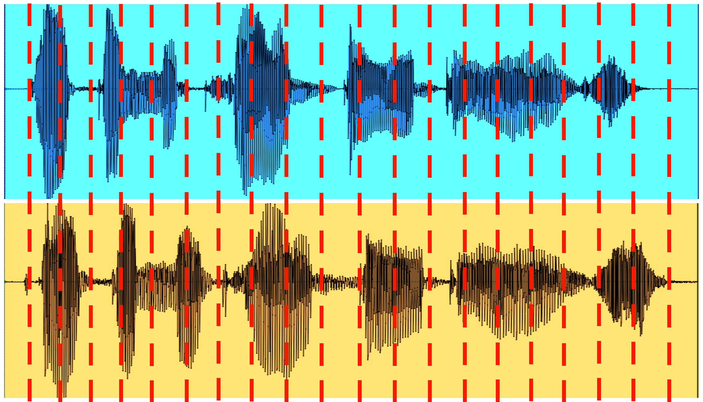
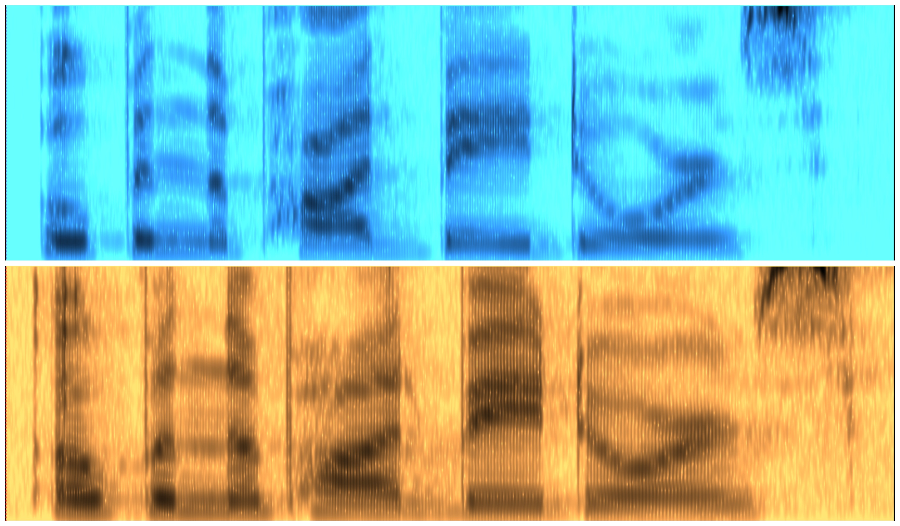
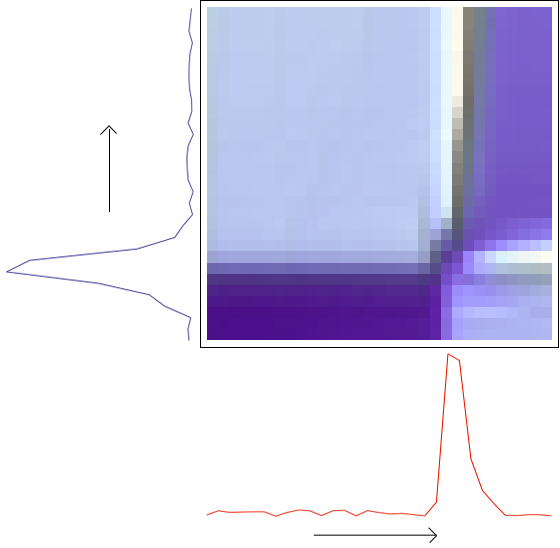

Speaker Verification
=======

This web app records and tests audio input against a pre-recorded voice password to verify speaker identity.

###Feature Analysis
#####(analysis_2.py)
Audio features are extracted using signal processing and Mel Frequency Cepstral Coefficient analysis. First, the original password is analyzed, and the extracted features create a unique voiceprint. Then the test audio recorded in the browser is analyzed and features extracted.

###Dynamic Time Warping
#####(dynamic.py)
After the features for the voiceprint and the test audio are extracted, they are compared to each other using Dynamic Time Warping. The output of this step is a number that represents how similar the two sets of features are. The closer the number is to zero, the more similar the features. After multiple tests, a base number is selected which determines whether or not a test audio is a match.

###Web App
#####(app.py, recorder.js, recorder.html)
Currently, the user is able to record his or her voice in the browser. The test audio is then saved temporarily and tested against my password. This portion utilizes Python, Flask, HTML5, Bootstrap, JavaScript, AJAX, and the navigator.getUserMedia() API.

###How Does It Work?

####Reading Audio Files
Each audio file is read using the Python numpy library. What you get is a list of numbers, or samples, and a rate. The above wavforms are these numbers when plotted as amplitude by time. To extract our features, we need to analyze this set of data in uniform segments.

####Spectral Analysis
These segments are then converted from the time domain to the frequency domain using the Fast Fourier Transform algorithm. The above diagram shows the audio in the frequency domain: time by frequency, and the grayscale represents amplitude. This is called a Spectrogram.

####Mel Frequency Cepstral Coefficients
The FFT's are then passed through Mel Filterbanks, like the one above. This lets us analyze the audios similarly to how our ears analyze sounds. The filterbanks are closer together in the lower frequencies, because we are able to differentiate between frequencies better at low tones. As frequencies get higher, it takes a larger jump between frequencies for us to tell the difference in tone. The resulting numbers are the unique set of Mel Frequency Cepstral Coefficients.

###Dynamic Time Warping
Once we have the MFCC's for both audiofiles, we need to compare them. When you are comparing the voiceprints of real audios, there are going to be variations. To help neutralize these variations, Dynamic Time Warping is used. DTW calculates the local distance between the sets of MFCC's and creates a matrix. It then finds the path of least resistance, like in the example above. A global distance measurment is made, and the output is a number. The closer the number is to zero, the closer the match. With some testing, we can then choose a base-case of what matches and what does not.

